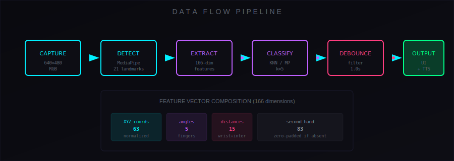
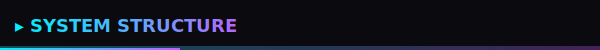
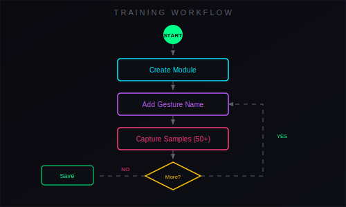
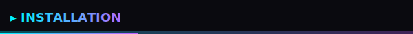

<div align="center">



**Real-time sign language gesture recognition powered by MediaPipe and machine learning.**

Translate hand gestures into text and speech directly in your browser—no installation required.

</div>


## Screenshot

<div align="center">

<!-- SCREENSHOT PLACEHOLDER: Replace with actual application screenshot -->
<!-- Recommended: 1280x720 or 1920x1080 PNG/JPG -->
```
┌─────────────────────────────────────────────────────────────────┐
│                                                                 │
│                    [ SCREENSHOT HERE ]                          │
│                                                                 │
│              Application interface screenshot                   │
│                                                                 │
└─────────────────────────────────────────────────────────────────┘
```

</div>


## System Overview

SLIS captures video from your webcam, detects hands using MediaPipe's 21-landmark model, extracts geometric features from hand poses, and classifies gestures using either pre-trained MediaPipe models or custom KNN classifiers you train yourself.

Recognized gestures are displayed on screen and optionally spoken aloud using the Web Speech API. The entire system runs client-side in the browser with no server communication required.

| Aspect | Detail |
|:-------|:-------|
| **Input** | Webcam video stream (640×480) |
| **Detection** | MediaPipe HandLandmarker (21 points per hand) |
| **Classification** | MediaPipe GestureRecognizer or KNN (k=5) |
| **Output** | Text display + Text-to-Speech |
| **Storage** | IndexedDB for trained modules |
| **Deployment** | Single HTML file, zero dependencies |


## Core Features

| Feature | Description |
|:--------|:------------|
|  **Hand Detection** | Tracks up to 2 hands simultaneously with 21 landmarks each |
|  **Gesture Recognition** | Classifies hand poses into named gestures with confidence scores |
|  **Custom Training** | Train your own gestures by capturing samples directly in the UI |
|  **Voice Output** | Speaks recognized gestures using system TTS voices |
|  **Module System** | Save, load, import, and export trained gesture modules |
|  **Skeleton Overlay** | Visual feedback showing detected hand structure |
|  **Adjustable Settings** | Configure confidence threshold, debounce timing, sensitivity |
|  **Offline Capable** | Works without internet after initial model load |


## How It Works



### Processing Pipeline

Each video frame passes through these stages:

| Stage | Input | Output | Time |
|:------|:------|:-------|:-----|
| **Capture** | Webcam stream | RGB frame (640×480) | ~33ms |
| **Detection** | RGB frame | 21 landmarks × 2 hands | ~15ms |
| **Extraction** | Landmarks | 166-dim feature vector | <1ms |
| **Classification** | Features | Gesture label + confidence | <5ms |
| **Debounce** | Raw predictions | Filtered output | configurable |
| **Output** | Filtered gesture | UI update + TTS | immediate |

### Feature Vector Composition

The 166-dimensional feature vector contains:

| Component | Dimensions | Description |
|:----------|:-----------|:------------|
| Normalized XYZ | 63 | Wrist-centered coordinates for 21 landmarks |
| Finger angles | 5 | Curl angle for each finger |
| Fingertip distances | 5 | Distance from wrist to each fingertip |
| Inter-finger distances | 10 | Pairwise distances between fingertips |
| Second hand | 83 | Same features (zero-padded if absent) |




## System Structure


### Core Components

| Component | Responsibility |
|:----------|:---------------|
| **SLISApp** | Main application controller, coordinates all subsystems |
| **ModuleDB** | IndexedDB wrapper for persistent module storage |
| **KNNClassifier** | K-nearest neighbors implementation for custom gestures |
| **FeatureExtractor** | Converts landmarks to normalized feature vectors |
| **MediaPipe** | Hand detection and pre-trained gesture recognition |

### Training Workflow



| Step | Action | Recommendation |
|:-----|:-------|:---------------|
| 1 | Create new module | Give it a descriptive name |
| 2 | Add gesture | Enter gesture name (e.g., "Hello") |
| 3 | Capture samples | Press SPACE to record, aim for 50+ samples |
| 4 | Vary your pose | Different angles, distances, lighting |
| 5 | Repeat for each gesture | More gestures = richer vocabulary |
| 6 | Finish training | Module saves to IndexedDB automatically |




## Installation & File Structure

```bash
# Clone or download the repository
git clone https://github.com/your-repo/slis.git
cd slis

# No build step required - open directly
open index.html

# Or serve locally for development
python -m http.server 8000
# Then visit http://localhost:8000
```

### Project Structure

```
slis/
├── index.html          # Complete application (single file)
├── README.md           # This documentation
└── assets/             # Optional: exported modules, screenshots
    ├── *.task          # MediaPipe gesture recognizer models
    └── *.json          # Exported trained modules
```

### Requirements

| Requirement | Minimum |
|:------------|:--------|
| Browser | Chrome 90+, Edge 90+, Firefox 90+ |
| Camera | Any webcam |
| Internet | Required only for initial model download |


## Demo

<div align="center">

<!-- VIDEO PLACEHOLDER: Replace with actual demo video -->
<!-- Recommended: MP4/WebM embed or YouTube/Vimeo link -->
```
┌─────────────────────────────────────────────────────────────────┐
│                                                                 │
│                    [ DEMO VIDEO HERE ]                          │
│                                                                 │
│              Embed video or link to demonstration               │
│                                                                 │
└─────────────────────────────────────────────────────────────────┘
```

</div>


<div align="center">


</div>
