<div align="center">

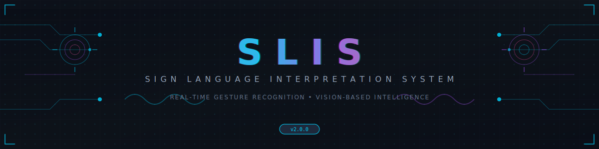

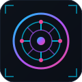

# **S L I S**
### SIGN LANGUAGE INTERPRETATION SYSTEM


[]()
[]()
[]()
[]()

**Real-time gesture recognition • Custom model training • Vision-based interpretation**

*A next-generation human-computer interaction system for bridging communication gaps*

</div>


<br>


## SYSTEM OVERVIEW

**SLIS** (Sign Language Interpretation System) is an advanced, browser-based gesture recognition platform that leverages cutting-edge computer vision and machine learning technologies to interpret hand gestures in real-time. Built on MediaPipe's hand landmark detection and a custom KNN classifier, SLIS provides both pre-trained gesture recognition and the ability to train custom gesture modules.

<br>

### CORE CAPABILITIES

| Capability | Description | Technology |
|:-----------|:------------|:-----------|
| **Real-time Detection** | Sub-50ms gesture recognition latency | MediaPipe + WebGL |
| **Custom Training** | Train personalized gesture modules | KNN Classifier |
| **Voice Synthesis** | Text-to-speech output for recognized gestures | Web Speech API |
| **Offline Storage** | Persistent module storage | IndexedDB |
| **Multi-hand Tracking** | Simultaneous dual-hand detection | MediaPipe Hands |
| **Adaptive Thresholds** | Configurable confidence and debounce | Custom Engine |

<br>

### TECHNICAL SPECIFICATIONS

```
┌─────────────────────────────────────────────────────────────────────────────┐
│  SLIS v2.0.0 :: TECHNICAL MANIFEST                                          │
├─────────────────────────────────────────────────────────────────────────────┤
│                                                                             │
│  RUNTIME ENVIRONMENT                                                        │
│  ├── Platform .............. Browser (Chrome 90+, Firefox 88+, Edge 90+)   │
│  ├── Rendering ............. HTML5 Canvas + WebGL 2.0                      │
│  ├── Compute ............... GPU-accelerated (WASM fallback)               │
│  └── Storage ............... IndexedDB (unlimited quota)                   │
│                                                                             │
│  VISION PIPELINE                                                            │
│  ├── Framework ............. MediaPipe Tasks Vision 0.10.3                 │
│  ├── Hand Landmarks ........ 21 points per hand (63 DOF)                   │
│  ├── Detection FPS ......... 30-60 FPS (hardware dependent)                │
│  └── Max Hands ............. 2 (configurable)                              │
│                                                                             │
│  CLASSIFICATION ENGINE                                                      │
│  ├── Algorithm ............. K-Nearest Neighbors (K=5)                     │
│  ├── Feature Vector ........ 166 dimensions                                │
│  ├── Distance Metric ....... Euclidean (weighted)                          │
│  └── Training Samples ...... 50-100+ per gesture (recommended)             │
│                                                                             │
│  AUDIO SUBSYSTEM                                                            │
│  ├── TTS Engine ............ Web Speech Synthesis API                      │
│  ├── Default Voice ......... Google UK English Male                        │
│  └── Rate Range ............ 0.5x - 2.0x                                   │
│                                                                             │
└─────────────────────────────────────────────────────────────────────────────┘
```

<br>


<br>


## DEMONSTRATION

<div align="center">

### Screenshot

<!-- SCREENSHOT PLACEHOLDER -->
```
┌─────────────────────────────────────────────────────────────────────────────┐
│                                                                             │
│                         [ SCREENSHOT PLACEHOLDER ]                          │
│                                                                             │
│                    Insert application screenshot here                       │
│                    Recommended: 1920x1080 PNG format                        │
│                                                                             │
└─────────────────────────────────────────────────────────────────────────────┘
```

<br>

### Demo Video

<!-- VIDEO PLACEHOLDER -->
```
┌─────────────────────────────────────────────────────────────────────────────┐
│                                                                             │
│                      [ DEMO VIDEO PLACEHOLDER ]                             │
│                                                                             │
│                  Embed video or link to demonstration                       │
│                  Recommended: MP4 or YouTube embed                          │
│                                                                             │
└─────────────────────────────────────────────────────────────────────────────┘
```

</div>

<br>


<br>

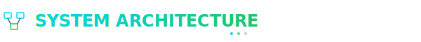

## SYSTEM ARCHITECTURE

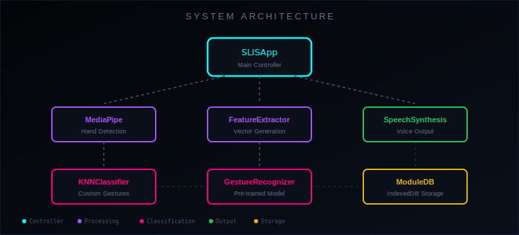

<br>

### ARCHITECTURAL LAYERS

```
╔═══════════════════════════════════════════════════════════════════════════════╗
║                           SLIS ARCHITECTURE STACK                             ║
╠═══════════════════════════════════════════════════════════════════════════════╣
║                                                                               ║
║  ┌─────────────────────────────────────────────────────────────────────────┐  ║
║  │  PRESENTATION LAYER                                                     │  ║
║  │  ┌──────────────┐ ┌──────────────┐ ┌──────────────┐ ┌──────────────┐   │  ║
║  │  │   Video      │ │   Canvas     │ │   Control    │ │   Debug      │   │  ║
║  │  │   Display    │ │   Overlay    │ │   Panel      │ │   Console    │   │  ║
║  │  └──────────────┘ └──────────────┘ └──────────────┘ └──────────────┘   │  ║
║  └─────────────────────────────────────────────────────────────────────────┘  ║
║                                    │                                          ║
║                                    ▼                                          ║
║  ┌─────────────────────────────────────────────────────────────────────────┐  ║
║  │  APPLICATION LAYER                                                      │  ║
║  │  ┌──────────────┐ ┌──────────────┐ ┌──────────────┐ ┌──────────────┐   │  ║
║  │  │   SLISApp    │ │   Module     │ │   Training   │ │   Voice      │   │  ║
║  │  │   Core       │ │   Manager    │ │   Engine     │ │   System     │   │  ║
║  │  └──────────────┘ └──────────────┘ └──────────────┘ └──────────────┘   │  ║
║  └─────────────────────────────────────────────────────────────────────────┘  ║
║                                    │                                          ║
║                                    ▼                                          ║
║  ┌─────────────────────────────────────────────────────────────────────────┐  ║
║  │  PROCESSING LAYER                                                       │  ║
║  │  ┌──────────────┐ ┌──────────────┐ ┌──────────────┐ ┌──────────────┐   │  ║
║  │  │   Feature    │ │   KNN        │ │   MediaPipe  │ │   Gesture    │   │  ║
║  │  │   Extractor  │ │   Classifier │ │   Handler    │ │   Recognizer │   │  ║
║  │  └──────────────┘ └──────────────┘ └──────────────┘ └──────────────┘   │  ║
║  └─────────────────────────────────────────────────────────────────────────┘  ║
║                                    │                                          ║
║                                    ▼                                          ║
║  ┌─────────────────────────────────────────────────────────────────────────┐  ║
║  │  DATA LAYER                                                             │  ║
║  │  ┌──────────────┐ ┌──────────────┐ ┌──────────────┐ ┌──────────────┐   │  ║
║  │  │   IndexedDB  │ │   Module     │ │   Training   │ │   Config     │   │  ║
║  │  │   Store      │ │   Cache      │ │   Data       │ │   State      │   │  ║
║  │  └──────────────┘ └──────────────┘ └──────────────┘ └──────────────┘   │  ║
║  └─────────────────────────────────────────────────────────────────────────┘  ║
║                                                                               ║
╚═══════════════════════════════════════════════════════════════════════════════╝
```

<br>


<br>

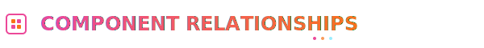

## COMPONENT RELATIONSHIPS

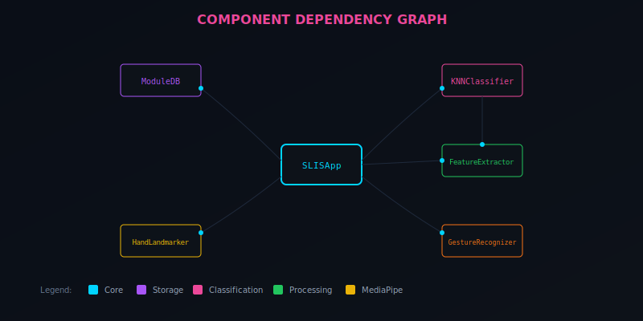

<br>

### CORE COMPONENTS

| Component | Responsibility | Dependencies |
|:----------|:---------------|:-------------|
| **SLISApp** | Main application orchestrator | All components |
| **ModuleDB** | IndexedDB wrapper for persistence | IndexedDB API |
| **KNNClassifier** | Custom gesture classification | FeatureExtractor |
| **FeatureExtractor** | Landmark to feature vector conversion | None |
| **HandLandmarker** | MediaPipe hand detection | MediaPipe WASM |
| **GestureRecognizer** | Pre-trained gesture recognition | MediaPipe WASM |

<br>

### COMPONENT INTERACTION MATRIX

```
                    ┌─────────┬─────────┬─────────┬─────────┬─────────┬─────────┐
                    │ SLISApp │ModuleDB │   KNN   │ Feature │  Hand   │ Gesture │
                    │         │         │Classifier│Extractor│Landmarkr│Recognzr │
┌───────────────────┼─────────┼─────────┼─────────┼─────────┼─────────┼─────────┤
│ SLISApp           │    ●    │    ◄──► │    ◄──► │    ◄──► │    ◄──► │    ◄──► │
├───────────────────┼─────────┼─────────┼─────────┼─────────┼─────────┼─────────┤
│ ModuleDB          │    ◄──► │    ●    │    ───► │    ·    │    ·    │    ·    │
├───────────────────┼─────────┼─────────┼─────────┼─────────┼─────────┼─────────┤
│ KNNClassifier     │    ◄──► │    ◄─── │    ●    │    ◄─── │    ·    │    ·    │
├───────────────────┼─────────┼─────────┼─────────┼─────────┼─────────┼─────────┤
│ FeatureExtractor  │    ◄──► │    ·    │    ───► │    ●    │    ·    │    ·    │
├───────────────────┼─────────┼─────────┼─────────┼─────────┼─────────┼─────────┤
│ HandLandmarker    │    ◄──► │    ·    │    ·    │    ·    │    ●    │    ·    │
├───────────────────┼─────────┼─────────┼─────────┼─────────┼─────────┼─────────┤
│ GestureRecognizer │    ◄──► │    ·    │    ·    │    ·    │    ·    │    ●    │
└───────────────────┴─────────┴─────────┴─────────┴─────────┴─────────┴─────────┘

●  = Self          ◄──► = Bidirectional          ───► = Unidirectional          · = None
```

<br>


<br>

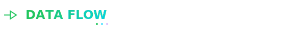

## DATA FLOW

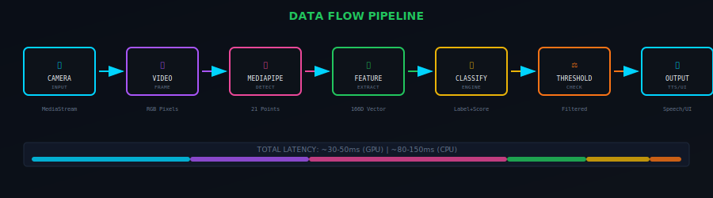

<br>

### RECOGNITION DATA PIPELINE

```
┌─────────────────────────────────────────────────────────────────────────────────────┐
│                           RECOGNITION DATA PIPELINE                                  │
└─────────────────────────────────────────────────────────────────────────────────────┘

  ┌─────────┐      ┌─────────┐      ┌─────────┐      ┌─────────┐      ┌─────────┐
  │ CAMERA  │ ───► │  VIDEO  │ ───► │MEDIAPIPE│ ───► │ FEATURE │ ───► │CLASSIFR │
  │  INPUT  │      │  FRAME  │      │ DETECT  │      │ EXTRACT │      │  ENGINE │
  └─────────┘      └─────────┘      └─────────┘      └─────────┘      └─────────┘
       │                │                │                │                │
       │                │                │                │                │
       ▼                ▼                ▼                ▼                ▼
  ┌─────────┐      ┌─────────┐      ┌─────────┐      ┌─────────┐      ┌─────────┐
  │MediaStrm│      │RGB Pixel│      │21 Points│      │166-dim  │      │ Label + │
  │ Object  │      │  Array  │      │per Hand │      │ Vector  │      │Confidnce│
  └─────────┘      └─────────┘      └─────────┘      └─────────┘      └─────────┘
                                                                            │
                                                                            ▼
                                                                      ┌─────────┐
                                                                      │THRESHOLD│
                                                                      │  CHECK  │
                                                                      └─────────┘
                                                                            │
                         ┌──────────────────────────────────────────────────┤
                         │                                                  │
                         ▼                                                  ▼
                   ┌─────────┐                                        ┌─────────┐
                   │ PASSED  │                                        │ FAILED  │
                   │ ───────►│                                        │ ───────►│
                   │   TTS   │                                        │ DISCARD │
                   └─────────┘                                        └─────────┘
                         │
                         ▼
                   ┌─────────┐      ┌─────────┐      ┌─────────┐
                   │DEBOUNCE │ ───► │SENTENCE │ ───► │  VOICE  │
                   │  GATE   │      │ BUFFER  │      │ OUTPUT  │
                   └─────────┘      └─────────┘      └─────────┘
```

<br>

### DATA TRANSFORMATION STAGES

| Stage | Input | Output | Transformation |
|:------|:------|:-------|:---------------|
| **1. Capture** | Camera Stream | Video Frame | MediaDevices API |
| **2. Detection** | RGB Frame | Hand Landmarks | MediaPipe Neural Net |
| **3. Normalization** | 21 3D Points | Relative Coords | Wrist-centered scaling |
| **4. Feature Extraction** | Normalized Points | 166D Vector | Geometric features |
| **5. Classification** | Feature Vector | Label + Score | KNN / GestureRecognizer |
| **6. Thresholding** | Raw Prediction | Filtered Result | Confidence gate |
| **7. Debouncing** | Filtered Result | Unique Gesture | Temporal filter |
| **8. Output** | Gesture Label | Audio/Visual | TTS + UI Update |

<br>


<br>


## TRAINING WORKFLOW

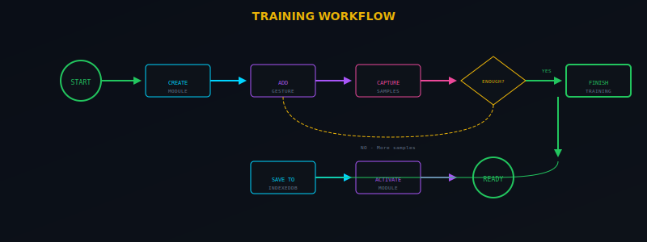

<br>

### TRAINING PROCESS

```
╔═══════════════════════════════════════════════════════════════════════════════╗
║                         CUSTOM GESTURE TRAINING FLOW                          ║
╠═══════════════════════════════════════════════════════════════════════════════╣
║                                                                               ║
║   ┌─────────────┐                                                             ║
║   │   START     │                                                             ║
║   │  TRAINING   │                                                             ║
║   └──────┬──────┘                                                             ║
║          │                                                                    ║
║          ▼                                                                    ║
║   ┌─────────────┐      ┌─────────────┐                                        ║
║   │   CREATE    │ ───► │    ADD      │◄─────────────────────┐                 ║
║   │   MODULE    │      │   GESTURE   │                      │                 ║
║   └─────────────┘      └──────┬──────┘                      │                 ║
║                               │                             │                 ║
║                               ▼                             │                 ║
║                        ┌─────────────┐                      │                 ║
║                        │   SELECT    │                      │                 ║
║                        │   GESTURE   │                      │                 ║
║                        └──────┬──────┘                      │                 ║
║                               │                             │                 ║
║                               ▼                             │                 ║
║   ┌─────────────┐      ┌─────────────┐      ┌─────────────┐ │                 ║
║   │   SHOW      │ ◄─── │   CAPTURE   │ ───► │   EXTRACT   │ │                 ║
║   │   HAND      │      │   SAMPLE    │      │   FEATURES  │ │                 ║
║   └─────────────┘      └──────┬──────┘      └──────┬──────┘ │                 ║
║                               │                    │        │                 ║
║                               │                    ▼        │                 ║
║                               │             ┌─────────────┐ │                 ║
║                               │             │   STORE IN  │ │                 ║
║                               │             │     KNN     │ │                 ║
║                               │             └──────┬──────┘ │                 ║
║                               │                    │        │                 ║
║                               ▼                    ▼        │                 ║
║                        ┌─────────────┐      ┌─────────────┐ │                 ║
║                        │   ENOUGH    │  NO  │    MORE     │ │                 ║
║                        │  SAMPLES?   │ ───► │  SAMPLES    │─┘                 ║
║                        └──────┬──────┘      └─────────────┘                   ║
║                               │ YES                                           ║
║                               ▼                                               ║
║                        ┌─────────────┐      ┌─────────────┐                   ║
║                        │    MORE     │  YES │    ADD      │                   ║
║                        │  GESTURES?  │ ───► │   GESTURE   │───────────────┐   ║
║                        └──────┬──────┘      └─────────────┘               │   ║
║                               │ NO                                        │   ║
║                               ▼                                           │   ║
║                        ┌─────────────┐                                    │   ║
║                        │   FINISH    │                                    │   ║
║                        │  TRAINING   │◄───────────────────────────────────┘   ║
║                        └──────┬──────┘                                        ║
║                               │                                               ║
║                               ▼                                               ║
║   ┌─────────────┐      ┌─────────────┐      ┌─────────────┐                   ║
║   │   EXPORT    │ ◄─── │   SAVE TO   │ ───► │  ACTIVATE   │                   ║
║   │    JSON     │      │  INDEXEDDB  │      │   MODULE    │                   ║
║   └─────────────┘      └─────────────┘      └─────────────┘                   ║
║                                                                               ║
╚═══════════════════════════════════════════════════════════════════════════════╝
```

<br>

### TRAINING BEST PRACTICES

| Parameter | Recommended | Minimum | Notes |
|:----------|:------------|:--------|:------|
| **Samples per gesture** | 100+ | 50 | More samples = better accuracy |
| **Hand variations** | 5+ angles | 3 | Rotate wrist during capture |
| **Distance variations** | 3 ranges | 2 | Near, medium, far from camera |
| **Lighting conditions** | Multiple | 1 | Train in expected use environment |
| **Capture interval** | 150ms | 100ms | Allows hand repositioning |

<br>


<br>


## RECOGNITION WORKFLOW

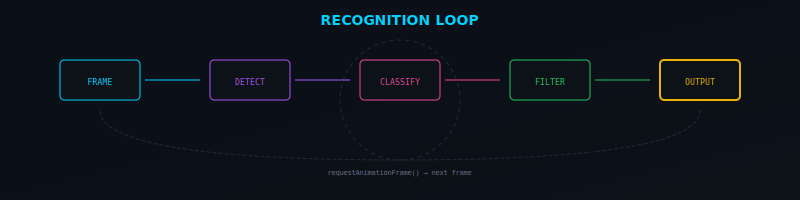

<br>

### RECOGNITION PIPELINE DETAIL

```
┌─────────────────────────────────────────────────────────────────────────────────────┐
│                          FRAME-BY-FRAME RECOGNITION LOOP                             │
└─────────────────────────────────────────────────────────────────────────────────────┘

  ╔═══════════════════════════════════════════════════════════════════════════════════╗
  ║  requestAnimationFrame() → processFrame()                                         ║
  ╚═══════════════════════════════════════════════════════════════════════════════════╝
                                          │
                                          ▼
  ┌───────────────────────────────────────────────────────────────────────────────────┐
  │  1. VIDEO READINESS CHECK                                                         │
  │     └── if (video.readyState < 2) → skip frame                                    │
  └───────────────────────────────────────────────────────────────────────────────────┘
                                          │
                                          ▼
  ┌───────────────────────────────────────────────────────────────────────────────────┐
  │  2. MEDIAPIPE DETECTION                                                           │
  │     ├── [TASK MODEL] gestureRecognizer.recognizeForVideo(video, timestamp)        │
  │     └── [HAND MODEL] handLandmarker.detectForVideo(video, timestamp)              │
  └───────────────────────────────────────────────────────────────────────────────────┘
                                          │
                                          ▼
  ┌───────────────────────────────────────────────────────────────────────────────────┐
  │  3. RESULT EXTRACTION                                                             │
  │     ├── landmarks: Array<Array<{x, y, z}>>  (21 points per hand)                  │
  │     ├── handedness: Array<{categoryName: 'Left'|'Right', score: number}>          │
  │     └── gestures: Array<{categoryName: string, score: number}> (task model only)  │
  └───────────────────────────────────────────────────────────────────────────────────┘
                                          │
                                          ▼
  ┌───────────────────────────────────────────────────────────────────────────────────┐
  │  4. SKELETON RENDERING (if enabled)                                               │
  │     ├── Draw connections with gradient glow                                       │
  │     └── Draw joints with radial gradients                                         │
  └───────────────────────────────────────────────────────────────────────────────────┘
                                          │
                                          ▼
  ┌───────────────────────────────────────────────────────────────────────────────────┐
  │  5. CLASSIFICATION BRANCH                                                         │
  │     ├── [TASK MODULE] → Use gesture result directly                               │
  │     └── [TRAINED MODULE] → Extract features → KNN predict                         │
  └───────────────────────────────────────────────────────────────────────────────────┘
                                          │
                                          ▼
  ┌───────────────────────────────────────────────────────────────────────────────────┐
  │  6. CONFIDENCE FILTERING                                                          │
  │     └── if (confidence < threshold) → discard                                     │
  └───────────────────────────────────────────────────────────────────────────────────┘
                                          │
                                          ▼
  ┌───────────────────────────────────────────────────────────────────────────────────┐
  │  7. DEBOUNCE FILTERING                                                            │
  │     └── if (gesture === lastGesture && timeDelta < debounce) → discard            │
  └───────────────────────────────────────────────────────────────────────────────────┘
                                          │
                                          ▼
  ┌───────────────────────────────────────────────────────────────────────────────────┐
  │  8. OUTPUT GENERATION                                                             │
  │     ├── Update UI display                                                         │
  │     ├── Append to sentence buffer                                                 │
  │     └── Trigger TTS (if auto-speak enabled)                                       │
  └───────────────────────────────────────────────────────────────────────────────────┘
```

<br>


<br>

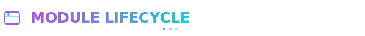

## MODULE LIFECYCLE


<br>

### MODULE STATES

```
┌─────────────────────────────────────────────────────────────────────────────────────┐
│                              MODULE STATE MACHINE                                    │
└─────────────────────────────────────────────────────────────────────────────────────┘

                              ┌─────────────────┐
                              │                 │
                              │    CREATED      │
                              │                 │
                              └────────┬────────┘
                                       │
                         ┌─────────────┴─────────────┐
                         │                           │
                         ▼                           ▼
              ┌─────────────────┐         ┌─────────────────┐
              │                 │         │                 │
              │    TRAINING     │         │    IMPORTED     │
              │                 │         │                 │
              └────────┬────────┘         └────────┬────────┘
                       │                           │
                       │                           │
                       ▼                           ▼
              ┌─────────────────┐         ┌─────────────────┐
              │                 │         │                 │
              │     SAVED       │◄────────│     LOADED      │
              │                 │         │                 │
              └────────┬────────┘         └────────┬────────┘
                       │                           │
                       └─────────────┬─────────────┘
                                     │
                                     ▼
                          ┌─────────────────┐
                          │                 │
                          │     ACTIVE      │
                          │                 │
                          └────────┬────────┘
                                   │
                    ┌──────────────┼──────────────┐
                    │              │              │
                    ▼              ▼              ▼
         ┌─────────────┐  ┌─────────────┐  ┌─────────────┐
         │  DEACTIVATE │  │   EXPORT    │  │   DELETE    │
         └──────┬──────┘  └─────────────┘  └──────┬──────┘
                │                                 │
                ▼                                 ▼
         ┌─────────────┐                  ┌─────────────┐
         │   INACTIVE  │                  │   REMOVED   │
         └─────────────┘                  └─────────────┘
```

<br>

### MODULE DATA STRUCTURE

```javascript
// Module Schema (IndexedDB)
{
  id: string,              // Unique identifier (e.g., "trained-1699123456789")
  name: string,            // Display name (e.g., "ASL Alphabet")
  type: "task" | "trained",// Module type
  url?: string,            // URL for task models
  gestures: Array<{        // Gesture definitions
    name: string,          // Gesture name
    sampleCount: number    // Number of training samples
  }>,
  knnData?: Array<{        // KNN training data (trained modules only)
    features: number[],    // 166-dimensional feature vector
    label: string          // Gesture label
  }>,
  createdAt: string,       // ISO timestamp
  version?: string         // Module version
}
```

<br>


<br>

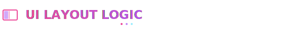

## UI LAYOUT LOGIC

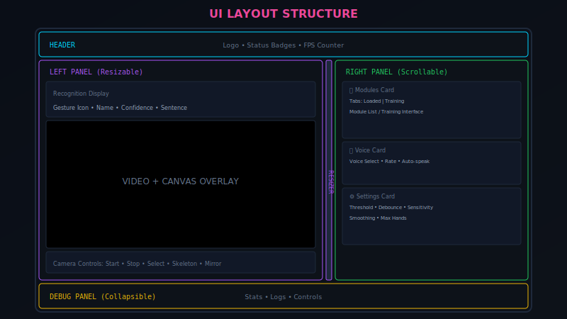

<br>

### LAYOUT STRUCTURE

```
┌─────────────────────────────────────────────────────────────────────────────────────┐
│  HEADER                                                                    [BADGES] │
│  ┌─────────────────────────────────────────────────────────────────────────────────┐│
│  │ 🤚 SLIS                                              [Camera] [Model] [FPS]     ││
│  └─────────────────────────────────────────────────────────────────────────────────┘│
├─────────────────────────────────────────────────────────────────────────────────────┤
│                                                                                     │
│  ┌─────────────────────────────────────────┐│┌─────────────────────────────────────┐│
│  │         LEFT PANEL (Resizable)          │││       RIGHT PANEL (Scrollable)      ││
│  │                                         │││                                     ││
│  │  ┌───────────────────────────────────┐  │││  ┌─────────────────────────────────┐││
│  │  │      RECOGNITION DISPLAY          │  │││  │         MODULES CARD            │││
│  │  │  ┌─────────┐  ┌─────────────────┐ │  │││  │  ┌───────────────────────────┐  │││
│  │  │  │ Gesture │  │    Sentence     │ │  │││  │  │ [Loaded] [Training] Tabs  │  │││
│  │  │  │  Icon   │  │     Area        │ │  │││  │  └───────────────────────────┘  │││
│  │  │  └─────────┘  └─────────────────┘ │  │││  │  ┌───────────────────────────┐  │││
│  │  └───────────────────────────────────┘  │││  │  │     Module List /         │  │││
│  │                                         │││  │  │     Training Interface    │  │││
│  │  ┌───────────────────────────────────┐  │││  │  └───────────────────────────┘  │││
│  │  │                                   │  │││  └─────────────────────────────────┘││
│  │  │                                   │  │││                                     ││
│  │  │         VIDEO CONTAINER           │  │││  ┌─────────────────────────────────┐││
│  │  │                                   │  │││  │          VOICE CARD             │││
│  │  │      ┌─────────────────────┐      │  │││  │  Voice selection, rate, auto    │││
│  │  │      │   Canvas Overlay    │      │  │││  └─────────────────────────────────┘││
│  │  │      │   (Skeleton)        │      │  │││                                     ││
│  │  │      └─────────────────────┘      │  │││  ┌─────────────────────────────────┐││
│  │  │                                   │  │││  │        SETTINGS CARD            │││
│  │  └───────────────────────────────────┘  │││  │  Threshold, debounce, etc.      │││
│  │                                         │││  └─────────────────────────────────┘││
│  │  ┌───────────────────────────────────┐  │││                                     ││
│  │  │        CAMERA CONTROLS            │  │││                                     ││
│  │  │ [Start] [Stop] | [Camera] | [☠️][🔄]│  │││                                     ││
│  │  └───────────────────────────────────┘  │││                                     ││
│  │                                         │││                                     ││
│  └─────────────────────────────────────────┘│└─────────────────────────────────────┘│
│                      ▲                      │                                       │
│                      │                      │                                       │
│                   RESIZER                   │                                       │
│                (Draggable)                  │                                       │
├─────────────────────────────────────────────────────────────────────────────────────┤
│  DEBUG PANEL (Collapsible)                                                          │
│  ┌─────────────────────────────────────────────────────────────────────────────────┐│
│  │ 🐛 Debug Console                                                    [Clear] [▲] ││
│  │ 📷 Camera: ON  |  🤖 MediaPipe: Ready  |  ✋ Hands: 2  |  📦 Model: Default     ││
│  │ [Log entries...]                                                                ││
│  └─────────────────────────────────────────────────────────────────────────────────┘│
└─────────────────────────────────────────────────────────────────────────────────────┘
```

<br>

### RESPONSIVE BEHAVIOR

| Viewport | Left Panel | Right Panel | Resizer |
|:---------|:-----------|:------------|:--------|
| **> 1200px** | 50-70% | 30-50% | Active |
| **800-1200px** | 45-65% | 35-55% | Active |
| **< 800px** | 100% (stacked) | 100% (stacked) | Hidden |

<br>


<br>


## PERFORMANCE CONSIDERATIONS

<br>

### OPTIMIZATION STRATEGIES

```
┌─────────────────────────────────────────────────────────────────────────────────────┐
│                           PERFORMANCE OPTIMIZATION MATRIX                            │
└─────────────────────────────────────────────────────────────────────────────────────┘

  ┌─────────────────────┬─────────────────────┬─────────────────────┬─────────────────┐
  │      CATEGORY       │       ISSUE         │      SOLUTION       │     IMPACT      │
  ├─────────────────────┼─────────────────────┼─────────────────────┼─────────────────┤
  │                     │                     │                     │                 │
  │  GPU Utilization    │  CPU-bound detect   │  WebGL delegate     │  ████████░░ 80% │
  │                     │                     │                     │                 │
  ├─────────────────────┼─────────────────────┼─────────────────────┼─────────────────┤
  │                     │                     │                     │                 │
  │  Memory Pressure    │  Large KNN dataset  │  Feature pruning    │  ██████░░░░ 60% │
  │                     │                     │                     │                 │
  ├─────────────────────┼─────────────────────┼─────────────────────┼─────────────────┤
  │                     │                     │                     │                 │
  │  Frame Drops        │  Canvas redraw      │  Dirty rect optim   │  ███████░░░ 70% │
  │                     │                     │                     │                 │
  ├─────────────────────┼─────────────────────┼─────────────────────┼─────────────────┤
  │                     │                     │                     │                 │
  │  Initial Load       │  WASM download      │  CDN + caching      │  █████████░ 90% │
  │                     │                     │                     │                 │
  ├─────────────────────┼─────────────────────┼─────────────────────┼─────────────────┤
  │                     │                     │                     │                 │
  │  Classification     │  KNN O(n) search    │  K-D tree (future)  │  ████░░░░░░ 40% │
  │                     │                     │                     │                 │
  └─────────────────────┴─────────────────────┴─────────────────────┴─────────────────┘
```

<br>

### RESOURCE CONSUMPTION

| Resource | Idle | Active (1 hand) | Active (2 hands) | Training |
|:---------|:-----|:----------------|:-----------------|:---------|
| **CPU** | ~2% | ~15% | ~20% | ~25% |
| **GPU** | ~5% | ~30% | ~40% | ~40% |
| **Memory** | ~50MB | ~150MB | ~200MB | ~250MB |
| **Network** | 0 | 0 | 0 | 0 (offline) |

<br>


<br>


## USE CASES

<br>

### PRIMARY APPLICATIONS

```
┌─────────────────────────────────────────────────────────────────────────────────────┐
│                              TARGET USE CASE MATRIX                                  │
└─────────────────────────────────────────────────────────────────────────────────────┘

  ┌─────────────────────────────────────────────────────────────────────────────────┐
  │  ACCESSIBILITY                                                                  │
  │  ├── Real-time sign language interpretation for deaf/hard-of-hearing users     │
  │  ├── Communication bridge between signing and non-signing individuals          │
  │  └── Educational tool for learning sign language                               │
  └─────────────────────────────────────────────────────────────────────────────────┘

  ┌─────────────────────────────────────────────────────────────────────────────────┐
  │  HUMAN-COMPUTER INTERACTION                                                     │
  │  ├── Gesture-based application control                                         │
  │  ├── Touchless interface for kiosks and public displays                        │
  │  └── Custom gesture shortcuts for productivity applications                    │
  └─────────────────────────────────────────────────────────────────────────────────┘

  ┌─────────────────────────────────────────────────────────────────────────────────┐
  │  RESEARCH & DEVELOPMENT                                                         │
  │  ├── Gesture recognition algorithm prototyping                                 │
  │  ├── Data collection for machine learning datasets                             │
  │  └── Comparative analysis of recognition approaches                            │
  └─────────────────────────────────────────────────────────────────────────────────┘

  ┌─────────────────────────────────────────────────────────────────────────────────┐
  │  EDUCATION                                                                      │
  │  ├── Interactive sign language learning platform                               │
  │  ├── Gesture vocabulary building and practice                                  │
  │  └── Real-time feedback for sign language students                             │
  └─────────────────────────────────────────────────────────────────────────────────┘
```

<br>


<br>

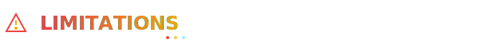

## LIMITATIONS

<br>

### KNOWN CONSTRAINTS

| Category | Limitation | Mitigation |
|:---------|:-----------|:-----------|
| **Detection** | Requires good lighting | Use in well-lit environments |
| **Detection** | Hands must be fully visible | Position camera appropriately |
| **Detection** | Occlusion causes failures | Avoid overlapping hands |
| **Classification** | Similar gestures may confuse | Train with more samples |
| **Classification** | KNN scales linearly | Limit training data per gesture |
| **Platform** | Browser-only | No native app support |
| **Platform** | Requires modern browser | Chrome 90+, Firefox 88+, Edge 90+ |
| **Language** | No sign language grammar | Word-level only, no sentences |
| **Language** | Limited vocabulary | Depends on trained modules |

<br>

### TECHNICAL DEBT

```
┌─────────────────────────────────────────────────────────────────────────────────────┐
│  KNOWN TECHNICAL LIMITATIONS                                                        │
├─────────────────────────────────────────────────────────────────────────────────────┤
│                                                                                     │
│  ⚠️  KNN classifier does not scale well beyond ~10,000 training samples             │
│  ⚠️  No support for dynamic gestures (motion-based signs)                           │
│  ⚠️  Single-frame classification (no temporal modeling)                             │
│  ⚠️  Feature vector is hand-crafted, not learned                                    │
│  ⚠️  No automatic gesture segmentation                                              │
│  ⚠️  Camera permission must be re-granted on some browsers after refresh            │
│                                                                                     │
└─────────────────────────────────────────────────────────────────────────────────────┘
```

<br>


<br>

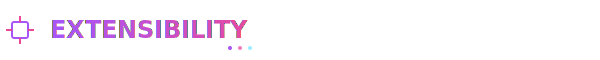

## EXTENSIBILITY

<br>

### EXTENSION POINTS

```
┌─────────────────────────────────────────────────────────────────────────────────────┐
│                            EXTENSIBILITY ARCHITECTURE                                │
└─────────────────────────────────────────────────────────────────────────────────────┘

  ┌─────────────────────────────────────────────────────────────────────────────────┐
  │  CLASSIFIER PLUGINS                                                             │
  │  ├── Replace KNN with neural network classifier                                │
  │  ├── Implement SVM or Random Forest alternatives                               │
  │  └── Add ensemble methods for improved accuracy                                │
  └─────────────────────────────────────────────────────────────────────────────────┘
                                          │
                                          ▼
  ┌─────────────────────────────────────────────────────────────────────────────────┐
  │  OUTPUT HANDLERS                                                                │
  │  ├── WebSocket broadcast for remote displays                                   │
  │  ├── Webhook integration for external services                                 │
  │  └── MIDI output for music/art applications                                    │
  └─────────────────────────────────────────────────────────────────────────────────┘
                                          │
                                          ▼
  ┌─────────────────────────────────────────────────────────────────────────────────┐
  │  VISUALIZATION THEMES                                                           │
  │  ├── Custom skeleton rendering styles                                          │
  │  ├── Alternative color schemes                                                 │
  │  └── Accessibility-focused visual modes                                        │
  └─────────────────────────────────────────────────────────────────────────────────┘
                                          │
                                          ▼
  ┌─────────────────────────────────────────────────────────────────────────────────┐
  │  MODULE FORMATS                                                                 │
  │  ├── Import from external training tools                                       │
  │  ├── Export to TensorFlow.js format                                            │
  │  └── Cloud sync for module sharing                                             │
  └─────────────────────────────────────────────────────────────────────────────────┘
```

<br>

### API HOOKS

```javascript
// Extension API (Future)
window.SLIS = {
  // Event hooks
  on: (event, callback) => { /* ... */ },
  off: (event, callback) => { /* ... */ },
  
  // Events: 'gesture', 'handDetected', 'handLost', 'moduleLoaded', 'trainingComplete'
  
  // Module API
  modules: {
    load: (moduleData) => { /* ... */ },
    export: (moduleId) => { /* ... */ },
    activate: (moduleId) => { /* ... */ }
  },
  
  // Recognition API
  recognition: {
    pause: () => { /* ... */ },
    resume: () => { /* ... */ },
    getLastResult: () => { /* ... */ }
  }
};
```

<br>


<br>

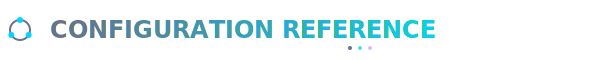

## CONFIGURATION REFERENCE

<br>

### USER-CONFIGURABLE PARAMETERS

| Parameter | Default | Range | Description |
|:----------|:--------|:------|:------------|
| **Confidence Threshold** | 60% | 10-95% | Minimum confidence to accept gesture |
| **Debounce Time** | 1.0s | 0.3-3.0s | Cooldown between same gesture |
| **Sensitivity** | 5 | 1-10 | Detection sensitivity level |
| **Smoothing** | 3 | 0-10 | Landmark smoothing factor |
| **Max Hands** | 2 | 1-2 | Maximum hands to track |
| **Voice Rate** | 1.0 | 0.5-2.0 | TTS speech rate |
| **Auto-speak** | Off | On/Off | Automatic voice output |
| **Show Skeleton** | On | On/Off | Hand skeleton overlay |
| **Mirror View** | Off | On/Off | Horizontal flip |

<br>

### INTERNAL CONSTANTS

```javascript
// Internal Configuration (Non-user-configurable)
const CONFIG = {
  KNN_K: 5,                    // K-nearest neighbors count
  FEATURE_DIMENSIONS: 166,     // Feature vector size
  CAPTURE_COOLDOWN_MS: 150,    // Training capture interval
  MIN_SAMPLES_WARNING: 20,     // Low sample warning threshold
  MIN_SAMPLES_GOOD: 50,        // Good sample threshold
  MAX_LOG_ENTRIES: 50,         // Debug log buffer size
  TOAST_DURATION_MS: 3000,     // Notification display time
  FPS_UPDATE_INTERVAL_MS: 1000 // FPS counter update rate
};
```

<br>


<br>


## QUICK START

<br>

### INSTALLATION

```bash
# Clone the repository
$ git clone https://github.com/your-org/slis.git

# Navigate to project directory
$ cd slis

# Serve with any static file server
$ python -m http.server 8080
# or
$ npx serve .
# or
$ php -S localhost:8080
```

<br>

### USAGE

```bash
┌─────────────────────────────────────────────────────────────────────────────────────┐
│  SLIS QUICK START GUIDE                                                             │
├─────────────────────────────────────────────────────────────────────────────────────┤
│                                                                                     │
│  1. OPEN APPLICATION                                                                │
│     └── Navigate to http://localhost:8080 in a modern browser                       │
│                                                                                     │
│  2. GRANT CAMERA PERMISSION                                                         │
│     └── Click "Allow" when prompted for camera access                               │
│                                                                                     │
│  3. START CAMERA                                                                    │
│     └── Click the "▶ Start Camera" button                                           │
│                                                                                     │
│  4. LOAD A MODEL                                                                    │
│     └── Click "⬇️ Load Default Model" or upload a custom .task/.json file           │
│                                                                                     │
│  5. START SIGNING                                                                   │
│     └── Position hands in camera view and perform gestures                          │
│                                                                                     │
│  6. VIEW RESULTS                                                                    │
│     └── Recognized gestures appear in the display area                              │
│                                                                                     │
└─────────────────────────────────────────────────────────────────────────────────────┘
```

<br>

### TRAINING CUSTOM GESTURES

```bash
┌─────────────────────────────────────────────────────────────────────────────────────┐
│  CUSTOM GESTURE TRAINING                                                            │
├─────────────────────────────────────────────────────────────────────────────────────┤
│                                                                                     │
│  1. Enable training mode (toggle in Modules card header)                            │
│  2. Enter a module name (e.g., "My Custom Signs")                                   │
│  3. Add gestures by name (e.g., "Hello", "Thank You")                               │
│  4. Select a gesture from the list                                                  │
│  5. Position your hand and press SPACE or click "📸 Capture"                        │
│  6. Capture 50-100+ samples with varied positions                                   │
│  7. Repeat for each gesture                                                         │
│  8. Click "✓ Finish Training" to save and activate                                  │
│                                                                                     │
└─────────────────────────────────────────────────────────────────────────────────────┘
```

<br>


<br>

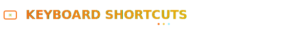

## KEYBOARD SHORTCUTS

| Key | Action | Context |
|:----|:-------|:--------|
| `Space` | Capture training sample | Training mode |
| `Ctrl+D` | Toggle debug panel | Global |
| `Escape` | Cancel current operation | Global |

<br>


<br>

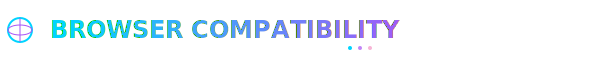

## BROWSER COMPATIBILITY

| Browser | Version | Status | Notes |
|:--------|:--------|:-------|:------|
| Chrome | 90+ | ✅ Full Support | Recommended |
| Firefox | 88+ | ✅ Full Support | - |
| Edge | 90+ | ✅ Full Support | Chromium-based |
| Safari | 15+ | ⚠️ Partial | WebGL issues on some devices |
| Opera | 76+ | ✅ Full Support | Chromium-based |
| Mobile Chrome | 90+ | ⚠️ Partial | Performance varies |
| Mobile Safari | 15+ | ⚠️ Partial | Limited WebGL |

<br>


<br>


## LICENSE

```
MIT License

Copyright (c) 2024 SLIS Project

Permission is hereby granted, free of charge, to any person obtaining a copy
of this software and associated documentation files (the "Software"), to deal
in the Software without restriction, including without limitation the rights
to use, copy, modify, merge, publish, distribute, sublicense, and/or sell
copies of the Software, and to permit persons to whom the Software is
furnished to do so, subject to the following conditions:

The above copyright notice and this permission notice shall be included in all
copies or substantial portions of the Software.

THE SOFTWARE IS PROVIDED "AS IS", WITHOUT WARRANTY OF ANY KIND, EXPRESS OR
IMPLIED, INCLUDING BUT NOT LIMITED TO THE WARRANTIES OF MERCHANTABILITY,
FITNESS FOR A PARTICULAR PURPOSE AND NONINFRINGEMENT. IN NO EVENT SHALL THE
AUTHORS OR COPYRIGHT HOLDERS BE LIABLE FOR ANY CLAIM, DAMAGES OR OTHER
LIABILITY, WHETHER IN AN ACTION OF CONTRACT, TORT OR OTHERWISE, ARISING FROM,
OUT OF OR IN CONNECTION WITH THE SOFTWARE OR THE USE OR OTHER DEALINGS IN THE
SOFTWARE.
```

<br>


<br>

<div align="center">


**SLIS** — Sign Language Interpretation System

*Bridging communication through vision-based intelligence*

<br>

[](https://mediapipe.dev/)
[](https://www.khronos.org/webgl/)
[]()

</div>
