<div align="center">


**AI-powered real-time sign language recognition using computer vision and machine learning.**

Transform hand gestures into text and speech directly in your browser — no server required, no data leaves your device.

[]()
[]()
[]()

</div>

---

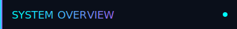

## System Overview

The **Sign Language Interpretation System (SLIS)** is a cutting-edge, browser-based application that interprets sign language gestures in real-time. Using advanced computer vision powered by MediaPipe and machine learning classification, it bridges communication gaps by converting hand movements into readable text and audible speech.

### Key Capabilities

| Capability | Description |
|:-----------|:------------|
| **Real-time Processing** | Processes webcam input at 30+ FPS with latency under 50ms |
| **Dual Recognition Modes** | Pre-trained ASL gestures + custom trainable gestures |
| **Complete Privacy** | All processing happens locally using WebAssembly/WebGL |
| **Zero Dependencies** | Single HTML file, no build process, no server required |
| **Persistent Learning** | Trained models saved to IndexedDB across sessions |

### How It Works (Brief)

```
┌──────────────┐    ┌──────────────┐    ┌──────────────┐    ┌──────────────┐
│   WEBCAM     │───▶│  MEDIAPIPE   │───▶│   FEATURE    │───▶│   OUTPUT     │
│   CAPTURE    │    │  DETECTION   │    │   CLASSIFY   │    │   TEXT/VOICE │
└──────────────┘    └──────────────┘    └──────────────┘    └──────────────┘
      30 FPS           21 landmarks        166-dim vector       Real-time
```

### Screenshot

<div align="center">

<!-- INSERT APPLICATION SCREENSHOT HERE -->
<!-- Recommended: 1280x720 or 1920x1080 PNG/JPG showing the main interface -->

```
╔══════════════════════════════════════════════════════════════════════════════╗
║                                                                              ║
║                     [ APPLICATION SCREENSHOT PLACEHOLDER ]                   ║
║                                                                              ║
║           Insert a screenshot showing the main interface with:               ║
║           • Webcam feed with hand landmark overlay                           ║
║           • Control panel with training options                              ║
║           • Recognition output display                                       ║
║                                                                              ║
╚══════════════════════════════════════════════════════════════════════════════╝
```

</div>

---


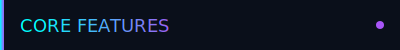

## Core Features

| Feature | Icon | Description | Technical Notes |
|:--------|:----:|:------------|:----------------|
| **Hand Detection** |  | Tracks up to 2 hands simultaneously, extracting 21 3D landmark points per hand at 30+ FPS | Uses MediaPipe HandLandmarker with WebAssembly backend and WebGL acceleration |
| **Gesture Recognition** |  | Classifies hand poses with confidence scoring, temporal smoothing, and debounce filtering | K-Nearest Neighbors (k=5) with inverse distance weighting prevents flickering |
| **Voice Output** |  | Converts recognized gestures to speech using configurable voice settings | Web Speech API with selectable voices, rate, and pitch controls |
| **Custom Training** |  | Train your own gestures by capturing samples directly in the browser | No coding required; 15-20 samples per gesture recommended for accuracy |
| **Persistent Storage** |  | Saves trained models and settings to IndexedDB for cross-session persistence | Automatic save/load with export/import functionality for sharing models |
| **Adaptive Interface** |  | Resizable split-panel layout with draggable divider and skeleton overlay toggle | Responsive design adapts to window size; dark theme optimized for accessibility |

### Feature Deep Dive

#### Hand Detection System

The detection system uses MediaPipe's HandLandmarker model, which identifies 21 key points on each hand:

- **Wrist** (1 point): Base reference for all measurements
- **Thumb** (4 points): CMC, MCP, IP, TIP joints
- **Index/Middle/Ring/Pinky** (4 points each): MCP, PIP, DIP, TIP joints

**Step-by-step process:**
1. Webcam captures RGB frame at ~30 FPS
2. Frame passed to MediaPipe via WebAssembly
3. Hand regions detected using palm detection model
4. Landmarks extracted using hand landmark model
5. 3D coordinates (x, y, z) returned for each point

#### Gesture Recognition Pipeline

The recognition system transforms raw landmarks into meaningful classifications:

1. **Normalization**: Landmarks centered on wrist, scaled to unit size
2. **Feature Extraction**: 166-dimensional vector computed (coords + angles + distances)
3. **Classification**: KNN compares against stored training samples
4. **Filtering**: Temporal smoothing prevents rapid switching between gestures
5. **Output**: Confident predictions displayed and optionally spoken

---


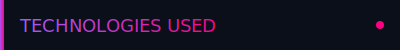

## Technologies Used

### Core Technologies

| Technology | Role | Implementation Details |
|:-----------|:-----|:-----------------------|
| **MediaPipe** | Hand detection & landmark extraction | WebAssembly build with WebGL acceleration; processes frames in ~15-25ms |
| **HTML5 Canvas** | Video display & landmark visualization | Real-time rendering of webcam feed with skeleton overlay |
| **Web Speech API** | Text-to-speech output | Browser-native speech synthesis with voice selection |
| **IndexedDB** | Persistent storage | Stores trained models, settings, and session data |
| **JavaScript ES6+** | Application logic | Vanilla JS with async/await, classes, modules |
| **CSS3** | Styling & animations | Custom properties, flexbox, grid, transitions |

### Optional Backend (Python)

| Technology | Role | Implementation Details |
|:-----------|:-----|:-----------------------|
| **FastAPI** | REST API server | Async framework for high-performance endpoints |
| **Uvicorn** | ASGI server | Production-ready server with hot reload |
| **Starlette** | HTTP toolkit | Foundation for FastAPI routing and middleware |

### Architecture Decisions

**Why Browser-Based?**
- **Privacy**: No data transmitted to external servers
- **Accessibility**: Works on any device with a modern browser
- **Performance**: WebAssembly + WebGL achieve near-native speeds
- **Simplicity**: Single file deployment, no installation required

**Why KNN Classification?**
- **Incremental Learning**: New gestures added without retraining entire model
- **Interpretability**: Easy to understand why classifications are made
- **Low Latency**: Classification in <5ms per frame
- **Small Footprint**: Model size scales linearly with training data

---


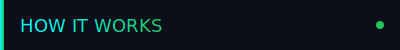

## How It Works

### System Architecture


**Component Interactions:**

| Component | Input | Output | Connects To |
|:----------|:------|:-------|:------------|
| **SLISApp** | User events, config | Commands, state | All components |
| **MediaPipe** | RGB frames | Landmark arrays | FeatureExtractor |
| **FeatureExtractor** | Landmarks | Feature vectors | KNNClassifier |
| **KNNClassifier** | Feature vectors | Labels + confidence | Output Handler |
| **ModuleDB** | Save/load requests | Model data | KNNClassifier |
| **SpeechSynthesis** | Text strings | Audio output | Output Handler |

### Data Processing Pipeline

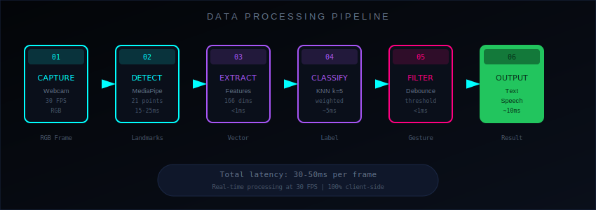

**Stage-by-Stage Breakdown:**

#### Stage 1: Capture (Webcam Input)
- **Input**: Raw video stream from getUserMedia API
- **Output**: RGB frames at ~30 FPS
- **Latency**: ~33ms per frame
- **Technical Note**: Constraints set for optimal resolution (640x480 default)

#### Stage 2: Detect (MediaPipe Processing)
- **Input**: RGB frame (Uint8Array)
- **Output**: Array of hand landmarks (21 points × 3 coordinates × 2 hands max)
- **Latency**: 15-25ms per frame
- **Technical Note**: WebGL backend preferred; falls back to CPU if unavailable

#### Stage 3: Extract (Feature Engineering)
- **Input**: Raw landmark coordinates
- **Output**: 166-dimensional feature vector
- **Latency**: <1ms
- **Technical Note**: Rotation-invariant features ensure consistent recognition regardless of hand orientation

**Feature Vector Composition:**

| Component | Dimensions | Description |
|:----------|:-----------|:------------|
| Normalized XYZ | 63 | Wrist-centered coordinates for 21 landmarks |
| Finger Angles | 5 | Bend angle (0-180°) for each finger |
| Fingertip Distances | 5 | Euclidean distance from each fingertip to wrist |
| Inter-finger Distances | 10 | Pairwise distances between all fingertips |
| **Total** | **83 per hand** | **166 for two hands** |

#### Stage 4: Classify (KNN Algorithm)
- **Input**: Feature vector
- **Output**: Gesture label + confidence score
- **Latency**: ~5ms
- **Technical Note**: Uses inverse distance weighting; k=5 neighbors vote on classification

#### Stage 5: Filter (Temporal Smoothing)
- **Input**: Raw classification results
- **Output**: Stable, filtered output
- **Latency**: <1ms
- **Technical Note**: Debounce prevents flickering; confidence threshold filters uncertain predictions

#### Stage 6: Output (Display & Speech)
- **Input**: Filtered gesture label
- **Output**: Visual display + optional speech
- **Latency**: ~10ms (speech synthesis async)
- **Technical Note**: Rate limiting prevents speech overlap

### Detection Pipeline Detail

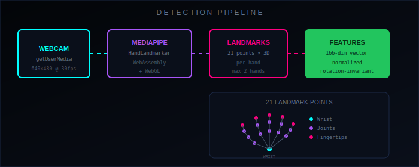

**MediaPipe HandLandmarker Configuration:**

```javascript
const config = {
  baseOptions: {
    modelAssetPath: 'hand_landmarker.task',
    delegate: 'GPU'  // WebGL acceleration
  },
  runningMode: 'VIDEO',
  numHands: 2,
  minHandDetectionConfidence: 0.5,
  minHandPresenceConfidence: 0.5,
  minTrackingConfidence: 0.5
};
```

---


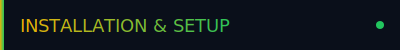

## Installation & Setup

### Pre-requirements

| Requirement | Minimum | Recommended |
|:------------|:--------|:------------|
| **Browser** | Chrome 90+, Edge 90+, Firefox 100+ | Chrome/Edge latest |
| **Hardware** | Webcam, WebGL 1.0 | HD webcam, WebGL 2.0 |
| **Permissions** | Camera access | Camera + Microphone |
| **Storage** | 50MB free | 100MB+ for models |
| **Network** | Initial load only | Offline capable after first load |

### Step 1: Download the Project

```bash
# Clone the repository
git clone https://github.com/yourusername/sign-language-interpretation-system.git

# Navigate to project directory
cd sign-language-interpretation-system
```

### Step 2: Choose Your Setup Method

#### Option A: Direct File Access (Simplest)

```bash
# Simply open index.html in your browser
# On macOS:
open index.html

# On Windows:
start index.html

# On Linux:
xdg-open index.html
```

> **Note**: Some browsers restrict webcam access for file:// URLs. If you encounter issues, use Option B or C.

#### Option B: Python Local Server

```bash
# Using Python 3
python -m http.server 8000

# Then navigate to:
# http://localhost:8000
```

#### Option C: Node.js Local Server

```bash
# Using npx (no installation required)
npx serve .

# Or install serve globally
npm install -g serve
serve .

# Then navigate to the displayed URL
```

#### Option D: Optional Python Backend

```bash
# Install dependencies
pip install -r requirements.txt

# Start the FastAPI server
uvicorn src.server:app --reload

# Server runs at http://localhost:8000
```

### Step 3: Grant Permissions

1. **Camera Access**: Click "Allow" when prompted by your browser
2. **Microphone** (optional): Required only for voice input features
3. **Storage**: Automatically granted for IndexedDB

### Step 4: Verify Installation

```
✓ Webcam feed appears in the main panel
✓ Hand landmarks overlay when hand is visible
✓ Status indicator shows "READY" or "DETECTING"
✓ Control panel is responsive
```

### Troubleshooting Tips

| Issue | Solution |
|:------|:---------|
| Webcam not detected | Check browser permissions; try different browser |
| Slow performance | Enable hardware acceleration in browser settings |
| Landmarks not showing | Ensure good lighting; hand should be clearly visible |
| Speech not working | Check system volume; some browsers require user interaction first |

---


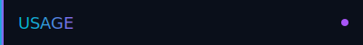

## Usage

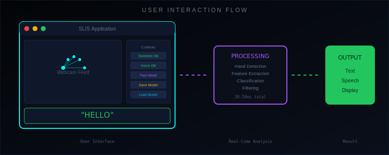

### Recognition Mode (Default)

**Step-by-step:**

1. **Launch Application**: Open index.html in your browser
2. **Allow Camera**: Grant webcam permission when prompted
3. **Position Hand**: Hold your hand in front of the camera (12-24 inches away)
4. **View Results**: Recognized gestures appear in the output panel
5. **Enable Voice**: Toggle "Voice Output" to hear gestures spoken aloud

**Interface Controls:**

| Control | Function | Keyboard Shortcut |
|:--------|:---------|:------------------|
| Toggle Skeleton | Show/hide hand landmark overlay | `S` |
| Toggle Voice | Enable/disable speech output | `V` |
| Voice Selection | Choose from available system voices | - |
| Clear Output | Reset the output display | `C` |

### Training Mode

**Step-by-step:**

1. **Enter Training Mode**: Click "Train" button or press `T`
2. **Name Your Gesture**: Type a label (e.g., "Hello", "Thank You")
3. **Position Hand**: Show the gesture you want to train
4. **Capture Samples**: Click "Capture" or press `Space` (repeat 15-20 times)
5. **Add Variations**: Slightly vary hand position/rotation between captures
6. **Save Model**: Click "Save" to persist to IndexedDB
7. **Test**: Return to Recognition Mode and test your gesture

**Training Best Practices:**

| Practice | Reason |
|:---------|:-------|
| Capture 15-20 samples per gesture | More samples = better accuracy |
| Vary hand position slightly | Improves robustness to positioning |
| Include different distances | Handles near/far variations |
| Use consistent lighting | Reduces false positives |
| Train similar gestures separately | Helps distinguish between them |

### Model Management

| Action | Description | How To |
|:-------|:------------|:-------|
| **Save Model** | Export trained gestures to JSON file | Click "Export" → Save file |
| **Load Model** | Import a previously saved model | Click "Import" → Select file |
| **Clear Model** | Remove all trained gestures | Click "Clear" → Confirm |
| **View Samples** | See captured training data | Click gesture name in list |

### Advanced Usage

**Custom Confidence Threshold:**

```javascript
// In browser console:
app.setConfidenceThreshold(0.8);  // Higher = stricter matching
```

**Adjust Debounce Time:**

```javascript
// In browser console:
app.setDebounceTime(500);  // Milliseconds between output changes
```

---


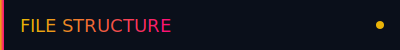

## File Structure

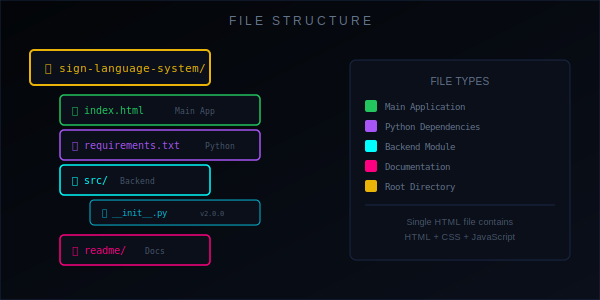

### Directory Layout

| Path | Type | Purpose |
|:-----|:-----|:--------|
| `index.html` | File | Complete application (HTML + CSS + JS in single file) |
| `requirements.txt` | File | Optional Python backend dependencies |
| `src/` | Directory | Optional Python server modules |
| `src/__init__.py` | File | Package initialization with version info |
| `readme/` | Directory | Documentation and visual assets |
| `readme/readme.md` | File | This documentation file |
| `readme/assets/` | Directory | SVG diagrams, icons, and images |

### Main Application Structure (index.html)

| Section | Lines (approx) | Description |
|:--------|:---------------|:------------|
| HTML Structure | 1-100 | Document layout, panels, controls |
| CSS Styles | 100-400 | Dark theme, responsive layout, animations |
| JavaScript Core | 400-800 | SLISApp class, state management |
| MediaPipe Integration | 800-1000 | Hand detection, landmark processing |
| Feature Extraction | 1000-1200 | Vector computation, normalization |
| KNN Classifier | 1200-1400 | Training, classification, storage |
| UI Handlers | 1400-1600 | Event listeners, DOM updates |
| Speech Synthesis | 1600-1700 | Voice output, configuration |

### Technology Stack Summary

| Layer | Technology | File/Location |
|:------|:-----------|:--------------|
| Frontend | HTML5, CSS3, JS ES6+ | `index.html` |
| Detection | MediaPipe HandLandmarker | CDN (loaded at runtime) |
| Classification | Custom KNN | `index.html` (inline) |
| Storage | IndexedDB | Browser API |
| Speech | Web Speech API | Browser API |
| Backend (optional) | FastAPI, Uvicorn | `src/`, `requirements.txt` |

---


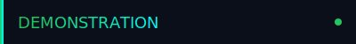

## Demonstration

<div align="center">

<!-- INSERT DEMO VIDEO HERE -->
<!-- Recommended: MP4/WebM, 30-60 seconds, showing gesture recognition in action -->

```
╔══════════════════════════════════════════════════════════════════════════════╗
║                                                                              ║
║                      [ DEMO VIDEO PLACEHOLDER ]                              ║
║                                                                              ║
║           Insert a video demonstration showing:                              ║
║           • Application startup and camera initialization                    ║
║           • Real-time gesture recognition in action                          ║
║           • Training a custom gesture                                        ║
║           • Voice output functionality                                       ║
║           • Model export/import workflow                                     ║
║                                                                              ║
║           Recommended format: MP4/WebM, 30-60 seconds                        ║
║           Recommended resolution: 1280x720 or higher                         ║
║                                                                              ║
╚══════════════════════════════════════════════════════════════════════════════╝
```

*Video demonstration showing real-time gesture recognition, custom training workflow, and voice output features*

</div>

---


